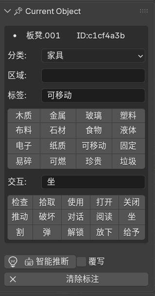
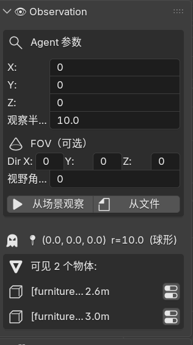
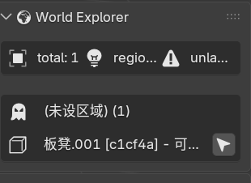
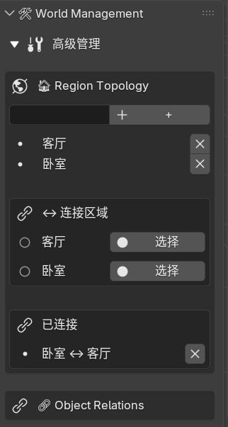
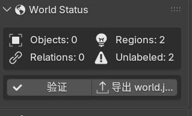

# 🏗️ AI World Builder

> 将 Blender 3D 场景转化为 AI 可理解的世界数据库

[]()

---

## 📖 这是什么？

AI World Builder 是一个 **Blender 5.0 插件**。你在 Blender 里搭建了一个虚拟世界（房间、家具、角色……），插件帮你告诉 AI 这些东西是什么、有什么属性、能做什么、空间怎么连通——就像给虚拟世界编了一份「说明书」。

**核心能力：**

| 功能 | 说明 |
|------|------|
| 🏷️ **物体标注** | 给每个 mesh 打上类型、标签、行为、属性 |
| 🗺️ **区域拓扑** | 划分空间（客厅/卧室/厨房），建立连通关系 |
| 🔗 **物体关系** | 标记物体之间的连接、包含、触发（如"灯连着开关"） |
| 👁️ **模拟 AI 观察** | 以任意位置半径"看"场景，支持 FOV 视野锥 |
| 📤 **导出世界数据** | 生成 AI 可读的 `world.json` |

---

## 📸 界面一览

### 🏷️ 标注当前物体


> 选中 mesh 后设置 **类型**（如"家具""角色"）、**标签**、**标志位**（可坐、可交互等）、**行为**（被点击时触发什么）、所在 **区域**。

---

### 👁️ 场景观察


> 模拟 AI 站在某个位置以某个视野范围「看」场景。设置观察者坐标、半径、FOV 角度和方向，点击 **从场景观察** 输出当前可见的物体列表。也可以 **从标记点观察**——以 3D 游标位置为中心。

---

### 🌍 世界浏览器


> 以树形结构展示整个世界的层次：**区域 → 物体类型 → 单个物体**。一键展开/折叠，直观看到世界全貌。

---

### 🔧 世界管理


> **Region Topology**：新增/删除区域、连接区域（如"客厅 ↔ 卧室"表示空间互通）。  
> **Object Relations**：建立物体之间的有向关系（如"开关 → 灯"表示开关控制灯）。

---

### ✅ 世界状态 & 验证


> 一键 **验证世界完整性**（检查重复 ID、孤立物体、关系引用是否有效）。  
> **导出 world.json** 供 AI 使用。

---

## 🚀 安装

1. 下载 `src/` 下的三个 `.py` 文件到 Blender addons 目录：
   - **Windows**: `%APPDATA%\Blender Foundation\Blender\5.0\scripts\addons\`
   - **macOS**: `~/Library/Application Support/Blender/5.0/scripts/addons/`
   - **Linux**: `~/.config/blender/5.0/scripts/addons/`
2. Blender → Edit → Preferences → Add-ons → 搜索 `World Builder` → 启用 ✅
3. 右侧 Sidebar（按 `N`）→ **World Builder** 面板

---

## 📂 文件结构

```
src/ai_world_builder.py      # 主插件 — UI 面板、标注、区域、关系
src/observation_builder.py   # 观察引擎 — 视野计算、FOV 裁剪
src/world_db.py              # 世界数据库 — 导入导出、验证
tests/                       # 测试 (224 passed ✅)
```

---

## 🔄 数据持久化

插件会在 `.blend` 文件同目录生成 `.awb_world_data.json`，自动保存区域拓扑和物体关系。重新打开文件时自动恢复。

---

## 🧪 开发

```bash
cd tests
python test_runtime.py   # 224 passed ✅
```

---

## 🙏 写在最后

> 作者很菜，但就是想玩。求求各方大佬往「可以更好 AI 接入虚拟世界」的方向完善它 ✨
>
> Bug 可能不少，但作者修不过来……在这里先给各位大佬磕一个 🧎

---

## 📄 License

MIT

---

MIT License
